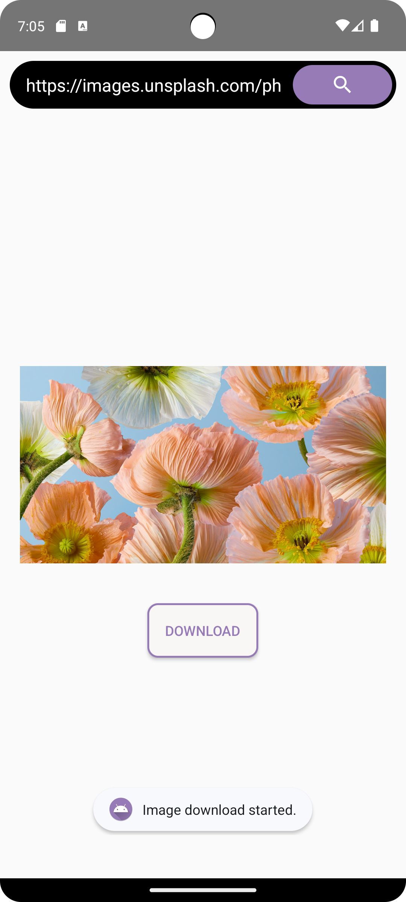

# Image Downloader App

## Overview

This Android application allows users to easily download images from URLs and save them to their device's photos using the phone's download manager. The app is built using the **MVP (Model-View-Presenter) architecture**, incorporating the OkHttp library to efficiently fetch images from the specified URLs, and threads have been incorporated to manage concurrent downloads.

## Features

- **Simple UI**: A user-friendly interface that makes it easy for users to input image URLs and initiate downloads.

- **Fast Downloads**: Utilizes the OkHttp library and multithreading for efficient and fast downloading of images from the provided URLs.

- **Download Manager Integration**: Saves downloaded images to the device's photos using the built-in Download Manager for easy access.

## Screenshots
   

## Libraries Used
**OkHttp**: Used for efficient HTTP requests and image downloading.

```
    implementation("com.squareup.okhttp3:okhttp:4.12.0")
```

  
## Threading

The image download process is executed in a separate thread to ensure a smooth user experience. OkHttp requests are wrapped in a `Runnable` to run concurrently, preventing the UI from freezing during downloads.
